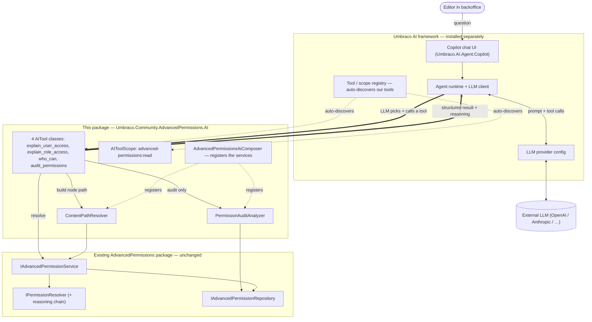

# Advanced Permissions for Umbraco — AI Copilot Tools

`Umbraco.Community.AdvancedPermissions.AI` is an **optional** companion package for
[Umbraco.Community.AdvancedPermissions](https://github.com/Luuk1983/Umbraco.Community.AdvancedPermissions).
It makes the Umbraco backoffice **AI copilot permission-aware**: editors and admins can ask, in plain
language, *who can do what* — and get answers grounded in the package's existing permission-resolution
engine (including the full reasoning chain), not in the model's guesswork.

> **This package is read-only.** It only *reads and explains* permissions. AI-*authored* permission
> changes (with a human approval step) are tracked separately in
> [issue #33](https://github.com/Luuk1983/Umbraco.Community.AdvancedPermissions/issues/33).

## What you can ask the copilot

| Tool | Example prompt |
|------|----------------|
| `explain_user_access` | *"Why can't Jane delete this page?"* |
| `explain_role_access` | *"What can the Editors group do on /News?"* |
| `who_can` | *"Who can publish here?"* |
| `audit_permissions` | *"Audit the permissions for the Editors role."* |

Each tool returns the **structured effective permission plus the reasoning chain**; the copilot turns
that into a sentence. The AI never decides permissions itself — it only routes the question to a tool
and phrases the deterministic result your resolver computes.

## Requirements

- **Umbraco CMS 17.4.0+** (.NET 10) — required by Umbraco AI.
- **[Umbraco AI](https://github.com/umbraco/Umbraco.AI) 1.14.0**, installed and configured with an LLM
  provider. The backoffice chat UI comes from `Umbraco.AI.Agent.Copilot`.
- **`Umbraco.Community.AdvancedPermissions`** (the main package) — pulled in automatically as a dependency.

> **Umbraco v18:** Umbraco AI does not support v18 yet, so this companion targets the **v17** line. It
> will be forward-ported to v18 once Umbraco AI ships v18 support
> (track [umbraco/Umbraco.AI#201](https://github.com/umbraco/Umbraco.AI/pull/201)).

## Install

```bash
dotnet add package Umbraco.Community.AdvancedPermissions.AI
```

The four tools and their permission scope (`advanced-permissions:read`) are **auto-discovered** by
Umbraco AI — no extra configuration beyond having Umbraco AI and an LLM provider set up.

## How it works



Request flow for *"Why can't Jane delete this page?"*:

```mermaid
sequenceDiagram
    actor E as Editor
    participant C as Umbraco AI Copilot
    participant L as LLM (via provider)
    participant T as uap_explain_user_access
    participant P as ContentPathResolver
    participant S as IAdvancedPermissionService

    E->>C: "Why can't Jane delete this page?"
    C->>L: prompt + tool catalogue + grounded context (node, user)
    Note over L: Picks explain_user_access;<br/>fills userKey, nodeKey, verb = Delete
    L->>T: invoke(userKey, nodeKey, "Umb.Document.Delete")
    T->>P: GetPathFromRoot(nodeKey)
    P-->>T: [rootKey … nodeKey]
    T->>S: ResolveAsync(user, node, path, verb)
    S-->>T: EffectivePermission { IsAllowed: false, reasoning[] }
    T-->>L: structured result (reasoning chain)
    L-->>C: turns the reasoning into plain language
    C-->>E: "Jane can't — Editors is explicitly Denied Delete at /News; this page inherits it."
```

- **Umbraco AI** (top) provides the copilot chat, the agent runtime, and the LLM connection.
- **This package** (middle) adds four auto-discovered `[AITool]` classes, a read-only tool scope, and
  two helper services (`ContentPathResolver`, `PermissionAuditAnalyzer`).
- **The existing permission package** (bottom) is **unchanged** — the tools call its
  `IAdvancedPermissionService`.

## Security

- **Read-only** — nothing the AI does here writes data.
- **No privilege escalation by design** — answers come from the same resolver the backoffice uses, so
  the model cannot invent or grant a permission rule; it can only report what your engine computes.
- Tools live under the `advanced-permissions:read` scope, so Umbraco AI's per-user-group governance can
  allow or deny them.

## Local verification (manual)

The test site in this repo is already wired to this package and the Umbraco AI runtime + copilot. To
verify end-to-end you only need to add **your own** LLM provider:

1. Add a provider package to the test site and pin its version, e.g.:
   ```bash
   dotnet add tests/Umbraco.Community.AdvancedPermissions.TestSite/Umbraco.Community.AdvancedPermissions.TestSite.csproj package Umbraco.AI.OpenAI
   ```
2. Set the key via user-secrets (not committed) and configure a connection/profile (in the backoffice AI
   UI on first run, or in `appsettings` referencing `$Umbraco:AI:Secrets:OpenAIApiKey`):
   ```bash
   dotnet user-secrets set "Umbraco:AI:Secrets:OpenAIApiKey" "sk-..." --project tests/Umbraco.Community.AdvancedPermissions.TestSite
   ```
3. Run and open the backoffice copilot:
   ```bash
   dotnet run --project tests/Umbraco.Community.AdvancedPermissions.TestSite -p:NuGetAudit=false --urls http://localhost:5000
   ```
4. Try: *"What can the Editors group do on the home page?"*, *"Who can publish here?"*,
   *"Audit the permissions for the Editors role."* and confirm the matching `uap_*` tool fires.

## Design notes / decisions

- **Optional companion package**, separate from the core package, so the permission package never forces
  the AI framework or an LLM provider on users who don't want it.
- **v17-first** — Umbraco AI is v17-only today; built and tested on v17, forward-ported to v18 when
  Umbraco AI supports it.
- **Native C# `[AITool]`s, not MCP** — Umbraco's MCP servers don't auto-expose custom Management API
  endpoints, and the in-backoffice copilot consumes C# tools directly. (An external MCP server for
  developer/automation agents is possible future work, not part of this package.)
- **Read-only first** — at Umbraco AI 1.14.0 a backend tool's `IsDestructive` flag does **not** trigger
  the copilot's human-in-the-loop approval (that is a frontend-tool mechanism). Permission *writes* are
  therefore deferred to [#33](https://github.com/Luuk1983/Umbraco.Community.AdvancedPermissions/issues/33),
  where they will be built as a frontend approval tool calling the existing permission endpoints.
- **Grounding deferred** — Umbraco AI already injects the focused node into the prompt, so a custom
  `IAIRuntimeContextContributor` is added only if live testing shows the copilot needs it.
